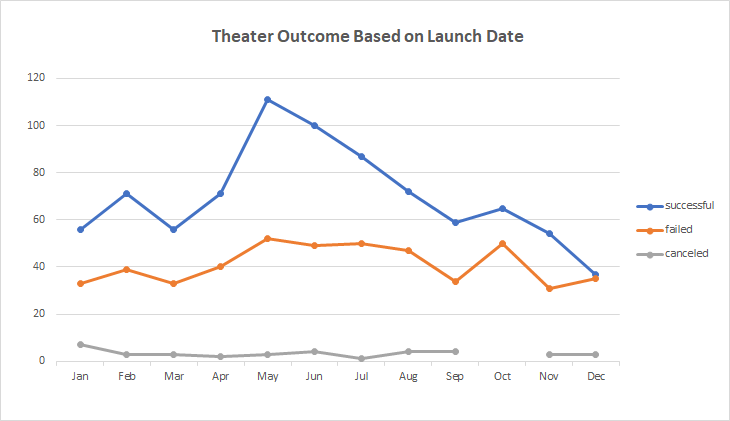
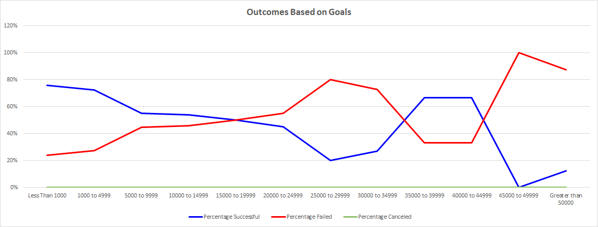

# Kickstarter Launch Date & Goals: The Best Time to Start a Kickstarter (and how much to ask for!)

## Overview of Project
Following up on the success of the fundraising for the play *Fever* Louise wanted to understand if there is a direct correlation between when a Kickstarter Campaign is launched and how much the goal amount is, as it pertains to whether or not the campaign is successful.  
### Purpose 
Providing better insight and understanding the correlation between the launch date of a Kickstarter Campaign and the Goal amount requested can help make a more informed decisions on when to launch a campaign and how much to set the goal for. This information may also help with the scheduling of plays, especially if we are relying on money from Kickstarter Campaigns to get the shows up and running. 
## Analysis and Challenges
The data (Kickstarter_data tab in the attached excel file** add link?) was ready to be used for data analysis, except for the addition of a year column which was added so that the first set of our analysis could be viewed by month. To achieve the data analysis results for the 'Outcomes Based on Goals' tab and visualization a 'countifs' formula need to be created to pull only the data we want to review. To ensure that there were no errors when pulling the data from the Kickstarter_data tab I created reference cells so that the formulas were pulling the same data for each cell.

* Row 1 has 'successful', 'failed', and 'canceled' (in cells D1,E1,F1) 
* Columns A & B have '>=' and '<=' values associated with goal row

*These cell references ensure that there are no spelling errors or errors on the goal references in the formulas used.* 

### Analysis of Outcomes Based on Launch Date
The *Outcomes Based on launch Date* data gave a great full year look at the the number of theater Kickstarter Campaigns and if they were successful, failed, or cancelled by month. It is easy to see which Months were the best to kick off a campaign if you were hoping for success in reaching your goal. 

### Analysis of Outcomes Based on Goals
Besides knowing the best Month to launch a Kickstarter Campaign we also want to understand which goal amount has the highest success rate and fits our need financially. To extract this data we created the *Outcomes Based on Goals* tab, which takes from the Kickstarter(data) tab and shows us only data from the 'plays' sub-categories, whether they were successful, failed, or cancelled, and fell within a specified group of values. 

### Challenges and Difficulties Encountered
This challenge was straight forward, and I am comfortable with excel.

## Results

- What are two conclusions you can draw about the Outcomes based on Launch Date?
  1. The most 'successful' time to launch a Kickstarter Campaign is in May, and the very beginning of summer. This period of time (May-July) also has the largest difference between successful and failed Kickstarter Campaign's
  2. The absolute worst month to launch a campaign is December, with a nearly 50/50 split of the campaign being successful or failing
- What can you conclude about the Outcomes based on Goals?
  -Though the highest percent of successful campaigns is 76%, the amount is low (less than $1000). The next highest success rate is 73% which falls in the $1000-$4999 goal range. This amount looks to be our sweet spot, with next largest % of successful campaigns being 67% ($35,000-$44,999) an amount that we could fund multiple plays with.
- What are some limitations of this dataset?
  -The data is old, with 2017 being the most recent year.
- What are some other possible tables and/or graphs that we could create?
  -Adding a sub-category filter to the *Theater Outcomes by Launch Date* where we are focusing on only plays may give a more refined search. 
  -A box and whisker could be added to see the months that have the largest difference between successful and failed goals.# Kickstarter Launch Date & Goals: The Best Time to Start a Kickstarter (and how much to ask for!)

## Overview of Project
Following up on the success of the fundraising for the play *Fever* Louise wanted to understand if there is a direct correlation between when a Kickstarter Campaign is launched and how much the goal amount is, as it pertains to whether or not the campaign is successful.  
### Purpose 
Providing better insight and understanding the correlation between the launch date of a Kickstarter Campaign and the Goal amount requested can help make a more informed decisions on when to launch a campaign and how much to set the goal for. This information may also help with the scheduling of plays, especially if we are relying on money from Kickstarter Campaigns to get the shows up and running. 
## Analysis and Challenges
The data (Kickstarter_data tab in the attached excel file** add link?) was ready to be used for data analysis, except for the addition of a year column which was added so that the first set of our analysis could be viewed by month. To achieve the data analysis results for the 'Outcomes Based on Goals' tab and visualization a 'countifs' formula need to be created to pull only the data we want to review. To ensure that there were no errors when pulling the data from the Kickstarter_data tab I created reference cells so that the formulas were pulling the same data for each cell.

* Row 1 has 'successful', 'failed', and 'canceled' (in cells D1,E1,F1) 
* Columns A & B have '>=' and '<=' values associated with goal row

*These cell references ensure that there are no spelling errors or errors on the goal references in the formulas used.* 

### Analysis of Outcomes Based on Launch Date
The *Outcomes Based on launch Date* data gave a great full year look at the the number of theater Kickstarter Campaigns and if they were successful, failed, or cancelled by month. It is easy to see which Months were the best to kick off a campaign if you were hoping for success in reaching your goal. 

### Analysis of Outcomes Based on Goals
Besides knowing the best Month to launch a Kickstarter Campaign we also want to understand which goal amount has the highest success rate and fits our need financially. To extract this data we created the *Outcomes Based on Goals* tab, which takes from the Kickstarter(data) tab and shows us only data from the 'plays' sub-categories, whether they were successful, failed, or cancelled, and fell within a specified group of values. 

### Challenges and Difficulties Encountered
This challenge was straight forward, and I am comfortable with excel.

## Results

- What are two conclusions you can draw about the Outcomes based on Launch Date?
  1. The most 'successful' time to launch a Kickstarter Campaign is in May, and the very beginning of summer. This period of time (May-July) also has the largest difference between successful and failed Kickstarter Campaign's
  2. The absolute worst month to launch a campaign is December, with a nearly 50/50 split of the campaign being successful or failing
- What can you conclude about the Outcomes based on Goals?
  - Though the highest percent of successful campaigns is 76%, the amount is low (less than $1000). The next highest success rate is 73% which falls in the $1000-$4999 goal range. This amount looks to be our sweet spot, with next largest % of successful campaigns being 67% ($35,000-$44,999) an amount that we could fund multiple plays with.
- What are some limitations of this dataset?
  - The data is old, with 2017 being the most recent year.
- What are some other possible tables and/or graphs that we could create?
  - Adding a sub-category filter to the *Theater Outcomes by Launch Date* where we are focusing on only plays may give a more refined search. 
  - A box and whisker could be added to see the months that have the largest difference between successful and failed goals.
